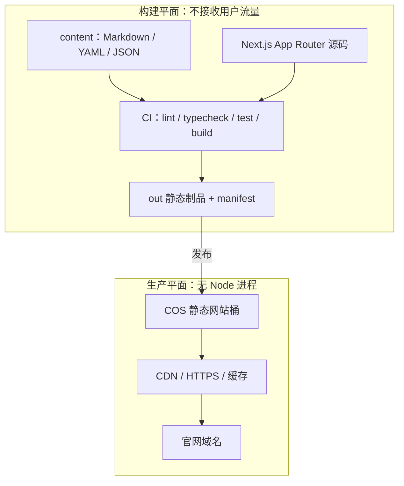
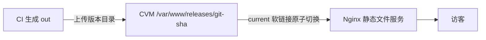

# 架构与技术边界

## 1. 运行架构



生产环境只有静态对象，没有应用进程和数据库连接。因此不会出现 Node 内存泄漏、Prisma 连接耗尽、容器上传文件丢失、NextAuth 会话失效或服务器补丁维护等运行时问题。

## 2. 建议仓库边界

```text
src/
├── app/                         # 只保留可静态生成的公开路由
├── components/                  # 展示组件和必要交互组件
└── lib/
    └── content/                 # 解析、校验、查询本地内容

content/
├── articles/
│   ├── article-slug.md
│   └── ...
├── stores/
│   ├── guangdong-shunde.yaml
│   └── ...
├── regions.yaml
└── schemas/                     # 内容格式说明或生成类型

public/
├── images/                      # 已优化、可直接发布的图片
└── static/

scripts/
├── validate-content.mjs         # slug、必填字段、重复项、内部链接
├── optimize-images.mjs          # 图片规格与体积门槛
├── generate-release-manifest.mjs
└── smoke-static-export.mjs
```

## 3. Next.js 配置模式

目标配置：

```ts
import type { NextConfig } from "next";

const nextConfig: NextConfig = {
  output: "export",
  trailingSlash: true,
  images: {
    unoptimized: true,
  },
};

export default nextConfig;
```

说明：

- 当前项目的 `output: "standalone"` 要改成 `output: "export"`。
- `next build` 直接生成 `out/`，不再运行 `next start`。
- `next/image` 默认在线优化器依赖 Next.js Server，静态导出不能使用。最简方案是构建前生成合适尺寸的 WebP/AVIF，并设置 `unoptimized: true`。
- `redirects()`、`headers()` 和 rewrites 不放在 `next.config.ts`；它们迁移到 CDN 规则或 Nginx 配置。

## 4. 路由规则

静态路由可以直接生成：

```text
/
/brand/
/product/
/contact/
/news/
/agent/
```

动态内容必须完整枚举：

```ts
export const dynamicParams = false;

export function generateStaticParams() {
  return articles.map((article) => ({ slug: article.slug }));
}
```

适用于：

- `/news/[slug]`
- `/agent/store/[id]`
- `/agent/[province]`
- `/agent/[province]/[city]`
- 产品车型专题动态路由

未在 `generateStaticParams()` 中生成的路径直接返回 404。静态模式没有 ISR，也不能在第一次访问时补生成页面。

## 5. 保留与移除能力

| 能力 | 静态站处理方式 |
|---|---|
| 首页、品牌、产品、联系方式 | 保留，构建成 HTML |
| 博客列表和详情 | Markdown 在构建时生成 |
| 门店列表、省市页和详情 | YAML/JSON 在构建时生成 |
| 客户端筛选 | 保留，数据量可控时内嵌精简 JSON |
| 电话、地图、微信咨询 | 保留为外链或客户端交互 |
| SEO metadata、JSON-LD、sitemap | 构建时生成 |
| Admin CMS | 从生产站移除；改为 Git PR 工作流 |
| NextAuth 登录 | 移除 |
| Prisma/PostgreSQL | 移除 |
| `/api/*` 写接口 | 移除 |
| Server Actions | 移除 |
| 在线上传图片 | 移除；图片随内容 PR 发布 |
| ISR / `revalidatePath` | 移除；重新构建全站 |
| 第一方服务端分析 | 移除；换成外部分析或 CDN 日志 |

## 6. COS/CDN 规划

最简方案只需要一个网站桶：

```text
lanhui-site-prod/
├── index.html
├── 404.html
├── _next/static/...
├── images/...
├── news/<slug>/index.html
└── agent/store/<id>/index.html
```

缓存规则：

| 路径 | Cache-Control | 原因 |
|---|---|---|
| `/_next/static/*` | `public, max-age=31536000, immutable` | 文件名带内容哈希 |
| `/images/*` | `public, max-age=31536000, immutable` | 图片文件名必须带版本/哈希 |
| `*.html` | `public, max-age=0, must-revalidate` | 发布后尽快读取新页面 |
| `sitemap.xml`、`robots.txt` | 短缓存 | 搜索引擎配置可能更新 |

必须开启：自定义域名、HTTPS、HTTP 自动跳转 HTTPS、访问日志、基础告警和 COS 版本控制。COS 禁止匿名写入，CI 使用仅允许指定桶同步/删除的最小权限凭证。

## 7. 如果必须保留一台 CVM

静态导出并不需要 CVM。如果公司已有服务器且必须部署在服务器上，则只让 Nginx 服务 `out/`：



此模式仍然没有 Node、Docker 应用和 PostgreSQL。它比 COS/CDN 多了服务器维护和单机故障面，只有在合规、内网或已有固定资产要求下采用。

## 8. 不适用条件

出现以下任一要求时，不应强行静态化：

- 运营必须在网站内登录并即时发布内容。
- 页面必须按用户身份、Cookie 或地理位置在服务端实时变化。
- 需要在线表单入库、订单、支付、库存或会员系统。
- 文章或门店数量大到每次全量构建超出可接受时间。
- 内容更新必须秒级上线且不能等待 CI。

这时应回到 `standalone Next.js + 托管 PostgreSQL + COS/CDN` 的轻量动态方案。

