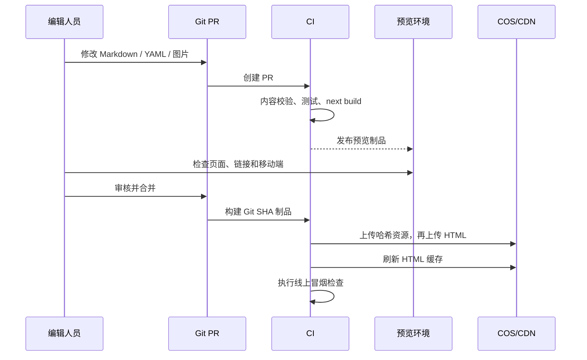
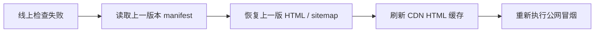

# 内容、发布与回滚操作

## 1. 内容源

### 博客

每篇文章一个 Markdown 文件：

```yaml
---
title: 顺德汽车改色膜选择指南
slug: shunde-car-wrap-guide
description: 面向顺德车主的改色膜选择和施工注意事项。
category: 改色膜
publishedAt: 2026-07-11
featuredImage: /images/articles/shunde-car-wrap-guide-v1.webp
draft: false
---
```

构建校验必须拒绝：重复 slug、无效日期、缺少 SEO 描述、图片不存在、正文为空、危险 HTML 和失效内部链接。

### 门店

每个门店一个 YAML 文件，或维护一个类型安全的 TypeScript 数据文件：

```yaml
id: shunde-daliang
slug: shunde-daliang
name: 蓝辉轻改顺德大良店
province: guangdong
city: foshan
district: shunde
status: active
phone: "联系电话"
address: "门店地址"
image: /images/stores/shunde-daliang-v1.webp
```

构建校验必须拒绝：重复 ID/slug、未知省市、门店状态非法、电话格式错误、图片缺失和同城市重复旗舰店。

### 图片

- 原图不直接进入生产目录。
- 发布图片应提供明确宽高，优先 WebP，必要时增加 AVIF。
- 文件名带版本或内容哈希，更新图片时生成新文件名。
- CI 限制单图体积、尺寸和总资源增量。

## 2. 内容发布流程



编辑人员不需要登录生产网站，也不能直接修改 COS。所有变更都留下 commit、PR、构建日志和发布记录。

## 3. CI 质量门

建议顺序：

```text
npm ci
npm run lint
npm run typecheck
npm test
npm run validate:content
npm run optimize:images:check
npm run build
npm run smoke:out
```

`smoke:out` 至少检查：

- `out/index.html` 与 `out/404.html` 存在。
- sitemap 中每个 URL 都有对应 HTML。
- HTML 不引用 `/api/`、`localhost` 或 `_next/image`。
- 所有内部链接、脚本、CSS 和图片存在。
- 首页、博客详情、门店详情不包含草稿内容。
- 构建输出没有数据库连接、服务端环境变量和 secret。

## 4. 发布顺序

静态站没有传统数据库迁移，但发布顺序仍需避免 HTML 引用不存在的新资源：

1. 生成 `out/` 和包含 SHA256 的 release manifest。
2. 上传 `_next/static` 和带版本的图片。
3. 上传其他非 HTML 文件。
4. 最后上传 HTML、sitemap 和 robots。
5. 刷新 CDN 的 HTML 路径，不刷新哈希资源。
6. 从公网执行关键路径检查。
7. 将 Git SHA、manifest、操作者和时间写入发布记录。

禁止先删除旧哈希资源。至少保留最近三个版本所引用的资源，再由清理任务根据 manifest 删除孤儿文件。

## 5. 回滚



为了让回滚可靠：

- COS 开启版本控制，HTML 可以恢复上一版本。
- 哈希资源至少保留三个发布周期。
- 每次发布保留完整 manifest，不能只记录 `latest`。
- 回滚只恢复 HTML 和入口文件，旧页面会重新引用仍然存在的旧资源。
- 发布失败时不继续执行资源清理。

## 6. 日常运营

| 频率 | 操作 |
|---|---|
| 每次发布 | 检查首页、博客、门店、404、sitemap、移动端关键页面 |
| 每日 | 外部探测首页和关键详情页，关注 CDN 4xx/5xx |
| 每周 | 检查失效链接、图片体积和构建时间趋势 |
| 每月 | 演练恢复上一版 HTML，检查 COS 版本和权限 |
| 每季度 | 演练从 Git commit 完整重建并发布全站 |

