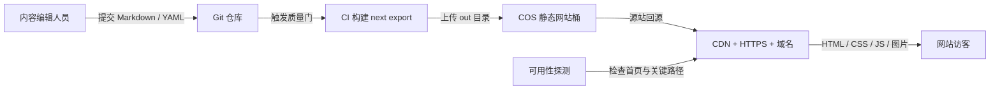

# Next.js 最简商用静态部署

本目录描述蓝辉官网被简化为 **Next.js Static Export** 后的生产架构。

核心定义：

- `next build` 输出完整的 `out/` 静态文件。
- 生产环境不运行 Node.js、Next.js Server、Docker 应用容器、PostgreSQL、Prisma、NextAuth、Admin CMS 或 Route Handlers。
- 博客和门店数据进入 Git，由 CI 在构建阶段生成 HTML。
- 图片提前处理为 WebP/AVIF，由 COS/CDN 分发。
- 每次内容更新都通过 PR、CI 构建、预览、发布和回滚。

## 推荐拓扑



这是当前官网能够采用的最简单商用形态：

```text
Git 内容源 → CI 构建 → COS 静态托管 → CDN/HTTPS → 用户
```

## 文档导航

- [架构与技术边界](./ARCHITECTURE.md)
- [内容、发布与回滚操作](./CONTENT-AND-RELEASE.md)
- [当前项目迁移清单](./MIGRATION-CHECKLIST.md)

## 一句话决策

如果公司接受“内容修改后等待一次构建发布”，并且不要求官网内置后台、登录、在线上传、运行时数据库和 SSR，那么静态部署是当前官网成本最低、故障面最小的商用方案。

